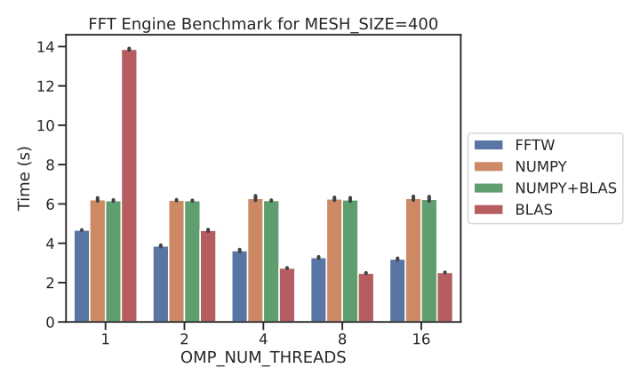

# Summary
This benchmark is meant to compares the different FFT engine options in PySCF. `BLAS` is the default.

# System Info

```
System: uname_result(system='Linux', node='ccqlinXXX.xxx.org', release='3.10.0-1127.19.1.el7.x86_64', version='#1 SMP Tue Aug 25 17:23:54 UTC 2020', machine='x86_64')  Threads 24
Python 3.9.6 (default, Oct 16 2021, 08:34:28) 
[GCC 10.2.0]
numpy 1.20.3  scipy 1.7.1
Date: Fri Nov  5 16:59:16 2021
PySCF version 2.0.0
```

# Results 
