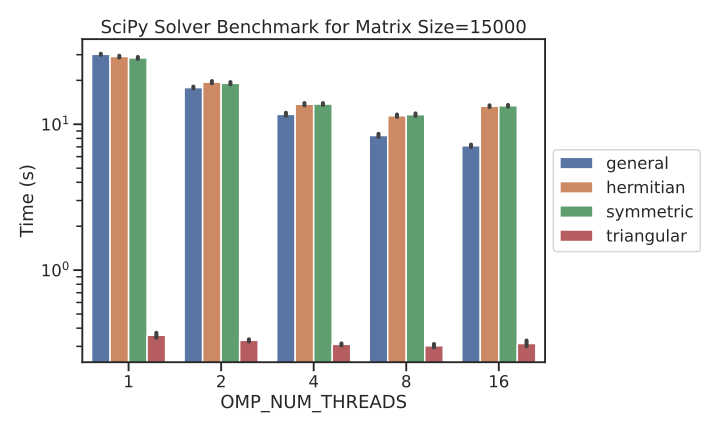

# Summary
This benchmark is meant to compares the different SciPy solvers and their threaded parallelism (or lack thereof).

# System Info

```
System: uname_result(system='Linux', node='ccqlinXXX.xxx.org', release='3.10.0-1127.19.1.el7.x86_64', version='#1 SMP Tue Aug 25 17:23:54 UTC 2020', machine='x86_64')  Threads 24
Python 3.9.7 (default, Oct 16 2021, 08:34:28) 
[GCC 10.2.0]
numpy 1.20.3  scipy 1.7.1
Date: Fri Nov  5 16:59:16 2021
PySCF version 2.0.0
```
The BLAS/LAPACK backend NumPy/SciPy is `intel-oneapi-mkl/2021.4.0`.

# Results 


# Running the Benchmark
To run this complete benchmark, run the script `run_benchmark.sh` in this directory.
Adjust the variables `N_REPEATS` to control how many times each benchmark is repeated (this will affect the quality of your statistics).
You can also adjust the size of the problem by adjusting the variable `SIZE`, larger values will require more memory and more operations.
You may also want to adjust set of thread values used in this benchmark.
Adjust the array in the `for` loop over `NTREADS` accordingly.